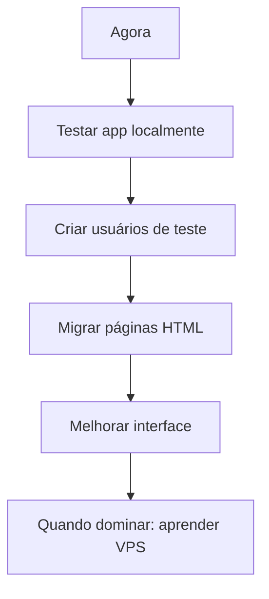

# 🎯 GUIA RÁPIDO: Suas Opções com VPS Hostinger

## 📊 **ANÁLISE DA SUA SITUAÇÃO:**

### ✅ **O que você JÁ TEM:**
- VPS Hostinger (infraestrutura pronta)
- Aplicação React funcionando localmente
- Credenciais Supabase válidas e funcionando
- Documentação completa de migração

### 🤔 **Suas OPÇÕES:**

## 🚀 **OPÇÃO 1: CONTINUAR COMO ESTÁ (RECOMENDADO PARA VOCÊ)**

### **Vantagens:**
✅ **Não precisa aprender VPS agora**
✅ **Aplicação já funcionando**
✅ **Supabase gerencia banco e autenticação**
✅ **Pode testar tudo localmente primeiro**

### **Como usar:**
```bash
# 1. Continuar desenvolvendo localmente
npm start  # http://localhost:3000

# 2. Quando quiser testar online, usar:
npm run build
# Upload do /build para qualquer hospedagem simples
```

### **Próximos passos fáceis:**
1. Criar usuários de teste
2. Migrar páginas HTML para React
3. Melhorar a interface

---

## 🏗️ **OPÇÃO 2: APRENDER VPS BÁSICO (Quando estiver pronto)**

### **Passos simples para começar:**

#### **1. Acessar sua VPS:**
```bash
# Conectar via SSH (Hostinger fornece os dados)
ssh seu_usuario@seu_ip_vps
```

#### **2. Instalar Node.js (básico):**
```bash
# Ubuntu/Debian (provável na Hostinger)
curl -fsSL https://deb.nodesource.com/setup_18.x | sudo -E bash -
sudo apt-get install -y nodejs

# Verificar instalação
node --version
npm --version
```

#### **3. Upload da aplicação:**
```bash
# Na sua VPS
mkdir -p /var/www/portal-dr-marcio
cd /var/www/portal-dr-marcio

# Upload via SCP, FTP ou Git
git clone seu_repositorio.git .
```

#### **4. Instalar e rodar:**
```bash
npm install
npm run build
npm install -g serve
serve -s build -l 3000
```

### **Recursos que você pode aprender depois:**
- Nginx (para domínios)
- PM2 (manter app rodando)
- SSL/HTTPS
- Backups automáticos

---

## 🎯 **MINHA RECOMENDAÇÃO PARA VOCÊ:**

### **Por que começar simples:**
1. **Você nunca usou VPS** - Aprender leva tempo
2. **Aplicação já funciona** - Não quebre o que está bom
3. **Supabase é perfeito** - Gerencia tudo complexo por você
4. **Pode evoluir depois** - VPS fica para quando precisar

### **Plano Sugerido:**


---

## 🔧 **Se quiser tentar VPS agora (opcional):**

### **Checklist básico:**
- [ ] **Acesso SSH funcionando**
- [ ] **Node.js instalado**
- [ ] **Aplicação uploadada**
- [ ] **Porta 3000 liberada no firewall**
- [ ] **Domínio apontando para VPS** (opcional)

### **Comandos básicos para começar:**
```bash
# Verificar sistema
uname -a
df -h
free -h

# Instalar ferramentas básicas
sudo apt update
sudo apt install curl wget git

# Instalar Node.js
curl -fsSL https://deb.nodesource.com/setup_18.x | sudo -E bash -
sudo apt-get install -y nodejs
```

---

## 💡 **PERGUNTA: O que você prefere?**

**A)** Continuar desenvolvendo localmente (recomendado)
**B)** Aprender VPS básico agora
**C)** Alguma outra abordagem

**Qual caminho você quer seguir?** 🤔

> 💡 **Dica:** Começar simples permite você focar no que realmente importa - **seu portal médico funcionando bem**!
